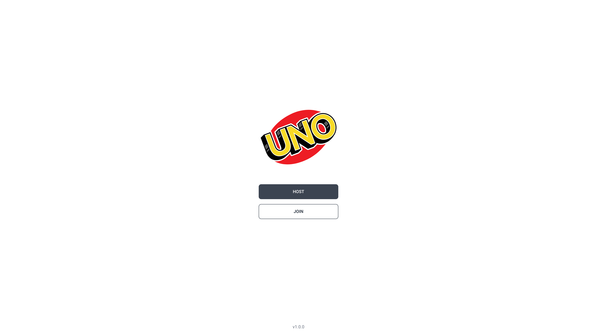
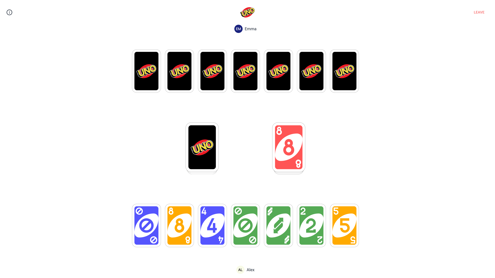
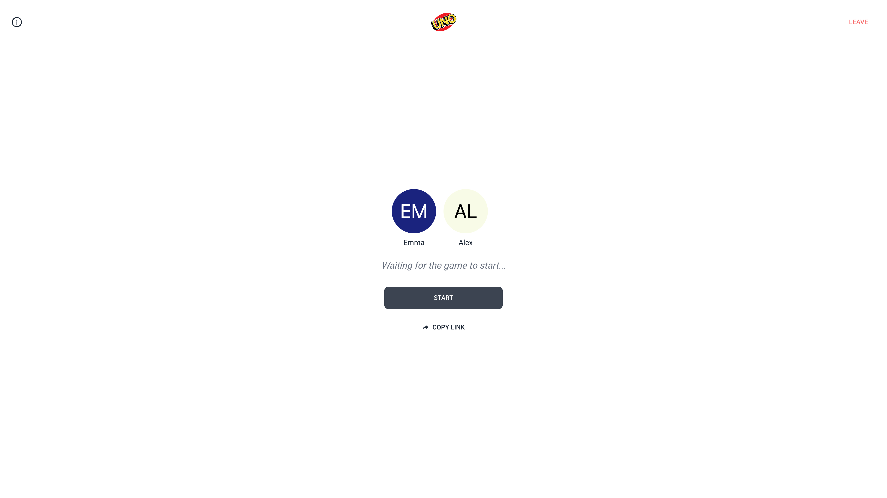
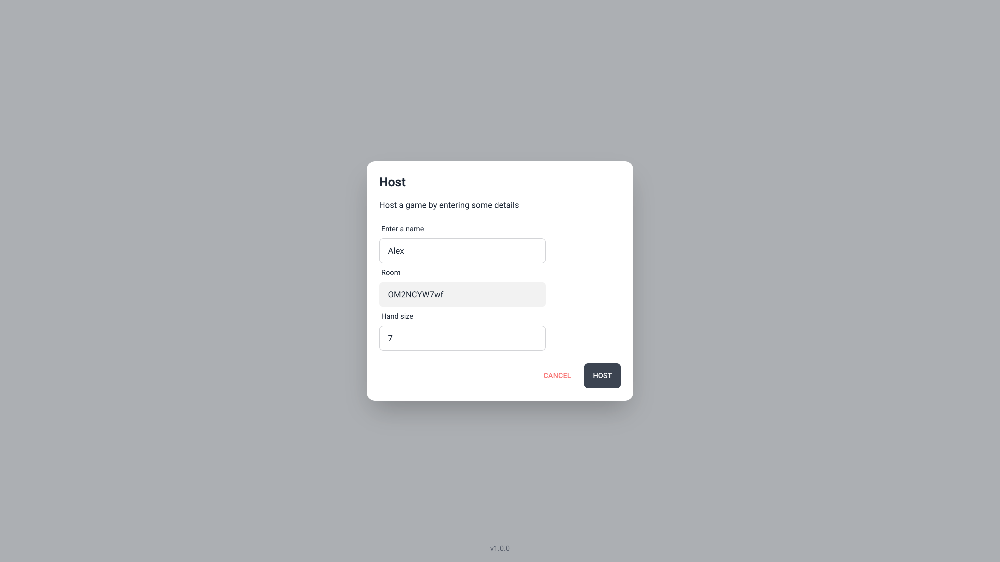

# [UNO](https://uno-web-4m6k.onrender.com)

Classic UNO card game implemented with React and Python using [Socket.IO](https://socket.io/) for realtime multiplayer functionality.

_Note: I made this for fun and personal use, please don't use this code in production._

## 📷 Screenshots




## 💻 Development

**Server**

```
$ cd server
$ python -m venv .venv
$ .venv\\Scripts\\activate
$ pip install -r requirements.txt
```

Optionally copy `.env.example` to `.env` and set `WEB_URL` to your frontend origin (use your ngrok HTTPS URL when tunneling).

```
# server/.env
ENVIRONMENT=development
WEB_URL=https://<your-ngrok-subdomain>.ngrok.io
```

Run the dev server:

```
$ python app.py
```

**Web**

```
$ cd web
$ pnpm install
```

Copy `.env.example` to `.env` and set the backend URLs (use your ngrok URLs when tunneling):

```
# web/.env
VITE_SERVER_HTTP_URL=https://<your-ngrok-subdomain>.ngrok.io
VITE_SERVER_WS_URL=wss://<your-ngrok-subdomain>.ngrok.io
```

Start the web app:

```
$ pnpm run dev
```

## 📖 TODO

- [ ] Better game validation rules
- [ ] Implement game log
- [ ] Host can kick player from room
- [ ] Place chance logic
- [ ] Generate random player name
- [ ] Player can remove a card from hand
- [ ] Migrate to a message broker like NATS?
